
<h1 align="center">基于web的网络游戏交易平台信息管理系统的设计与实现+vue</h1>

## 简介
基于Web的网络游戏交易平台信息管理系统：角色分为管理员、用户；包括个人中心、公告信息管理、商品管理、购物车、充值模块、商品评价及订单管理等功能。    --计算机毕业设计源码；毕设源码；java毕业设计源码

## 联系方式

<h3 align="center">获取完整代码与数据库文件 + 微信：deepguan QQ: 86050149 QQ群: 783742310</h3>

<h3 align="center">可帮忙远程部署 包运行成功！提供远程部署、修改代码、设计文档指导、代码讲解等服务！</h3>

## 功能介绍（完整见运行截图）
管理员：管理员可以通过系统进行登录，并访问主导航栏、公告管理、商品管理及购物车管理界面。管理员具备管理用户信息和店铺信息的权限，支持商品的上架、下架、编辑和删除操作。管理员还可以查看和管理商品评价，以及执行订单退款和公告信息更新功能，以维护交易平台的正常运营并优化用户体验。

用户：用户通过注册和登录进入平台，访问主页并查看系统推荐商品列表及其详细信息，并通过购物车完成在线交易。用户可以在个人中心管理订单和地址信息，编辑个人资料和查看商品收藏。此外，用户能够对已购买的商品进行评价和查看历史评价，确保交易的透明度和体验的提升。

商家：商家通过注册和登录来管理其店铺信息，编辑和发布商品信息。商家可以查看和管理商品库存，响应用户评价，并及时更新公告信息，以提升店铺的服务质量。商家还可以通过该平台追踪销量和支付状态，以进行数据分析和经营策略调整。

游客：作为未注册用户，游客可以浏览平台的主页和商品信息，但无法进行购买操作。游客能够通过注册成为用户以获取完整功能，享受到交易及个人化管理服务。

## 运行截图
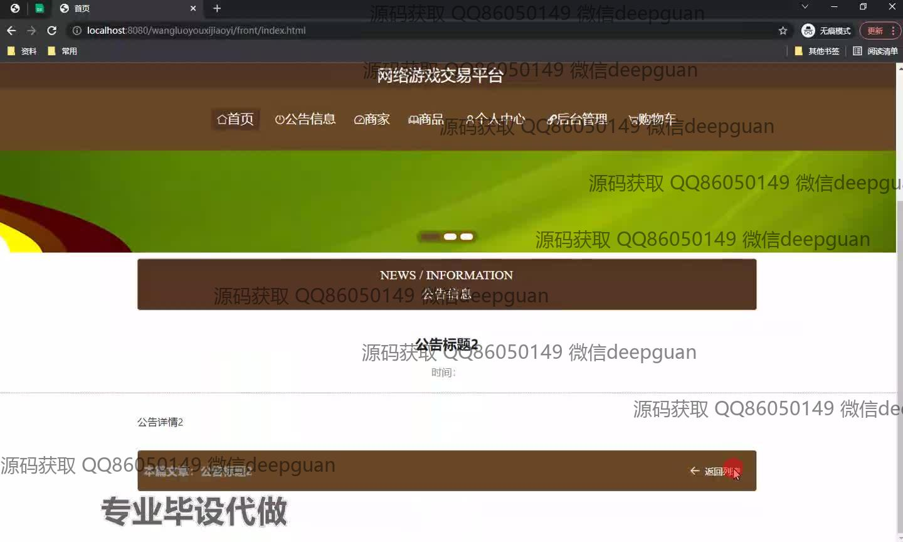
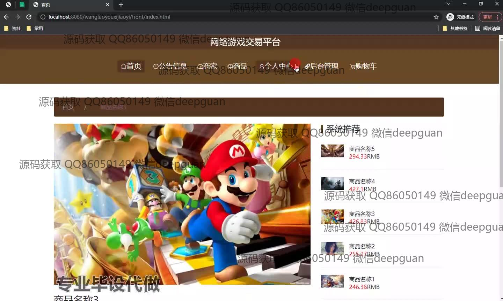
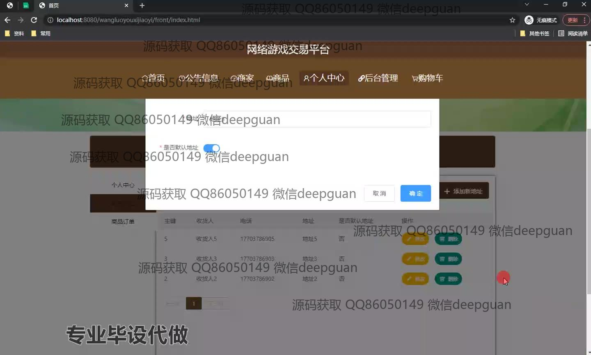
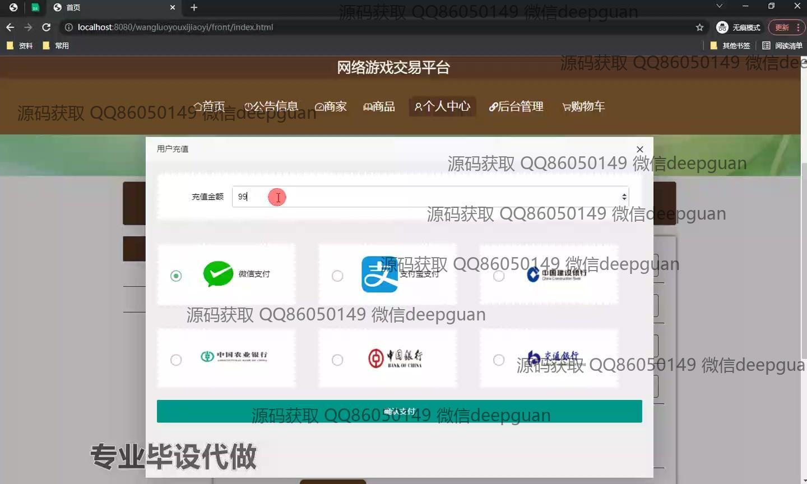
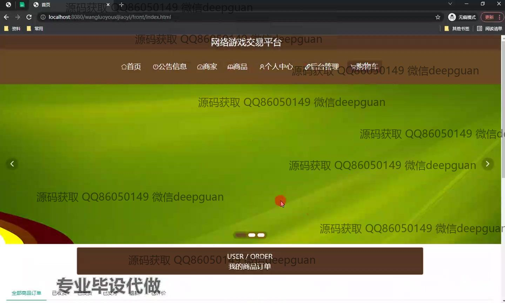

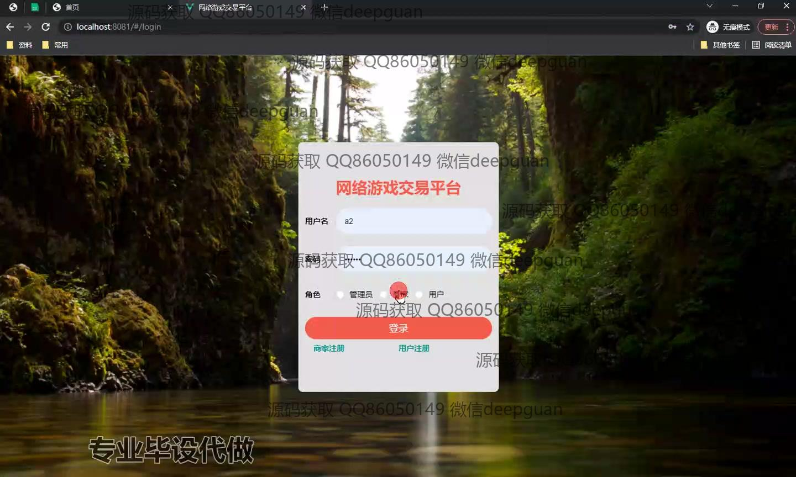
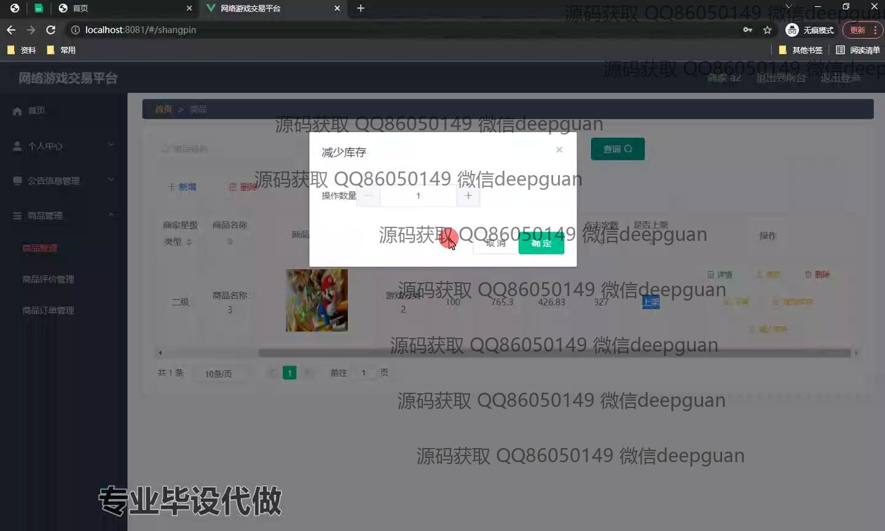

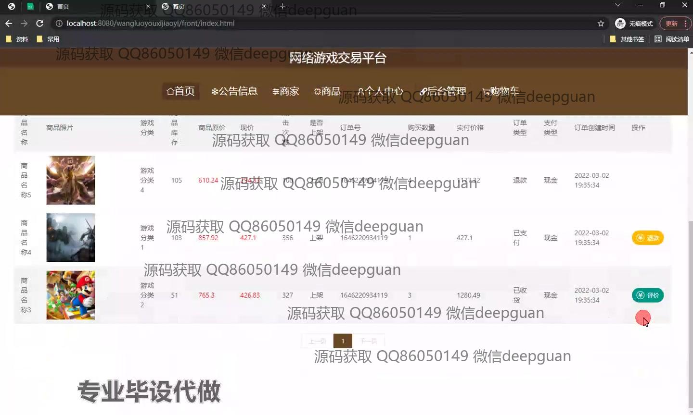
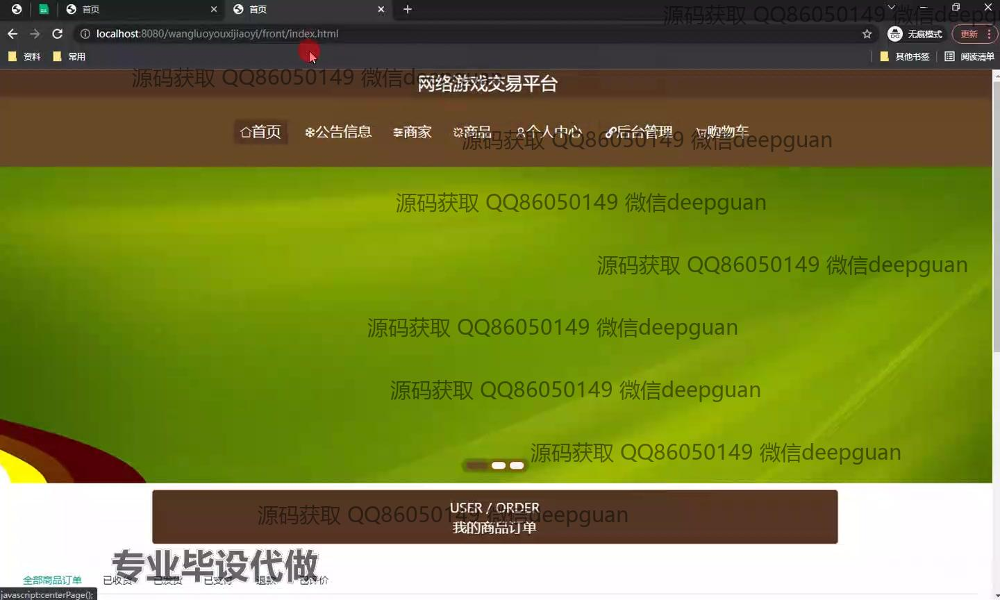
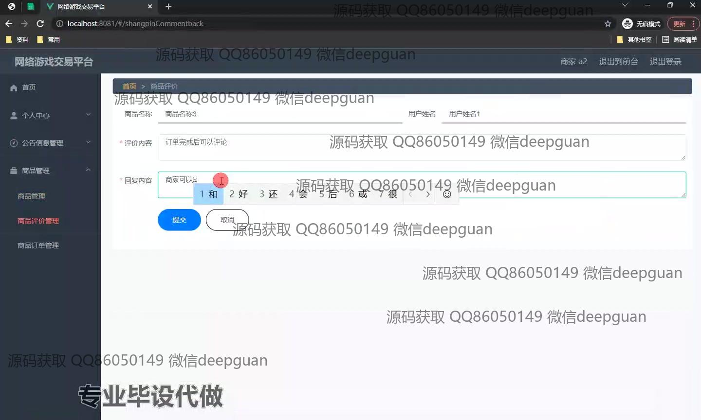
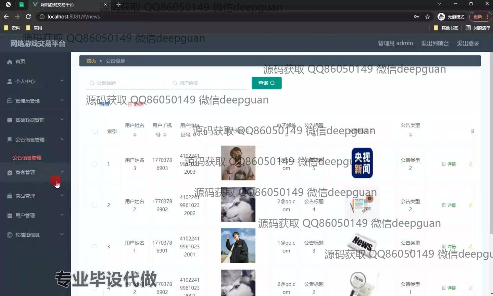
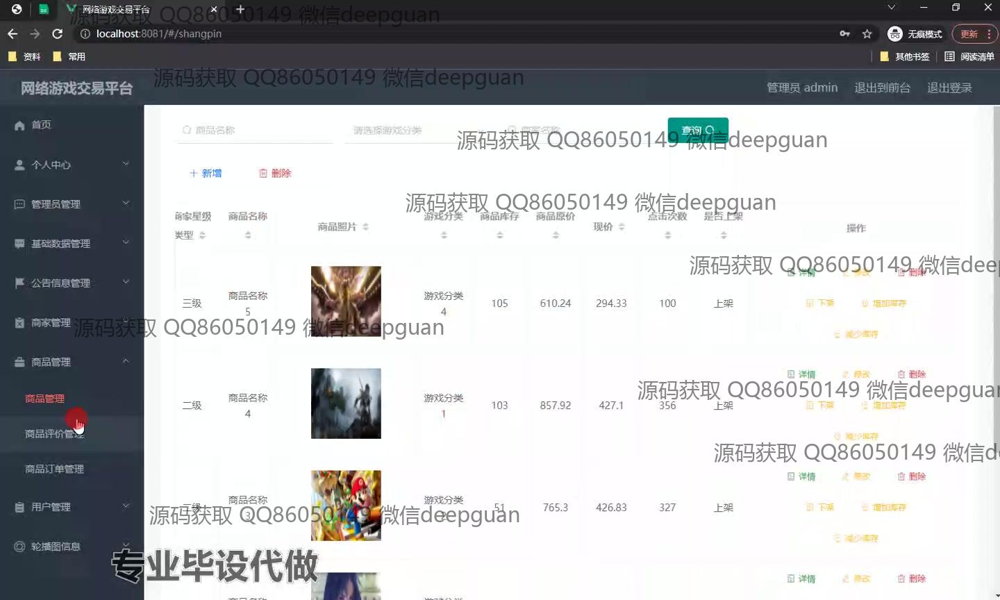

本代码来源于网络,仅供学习参考使用!

